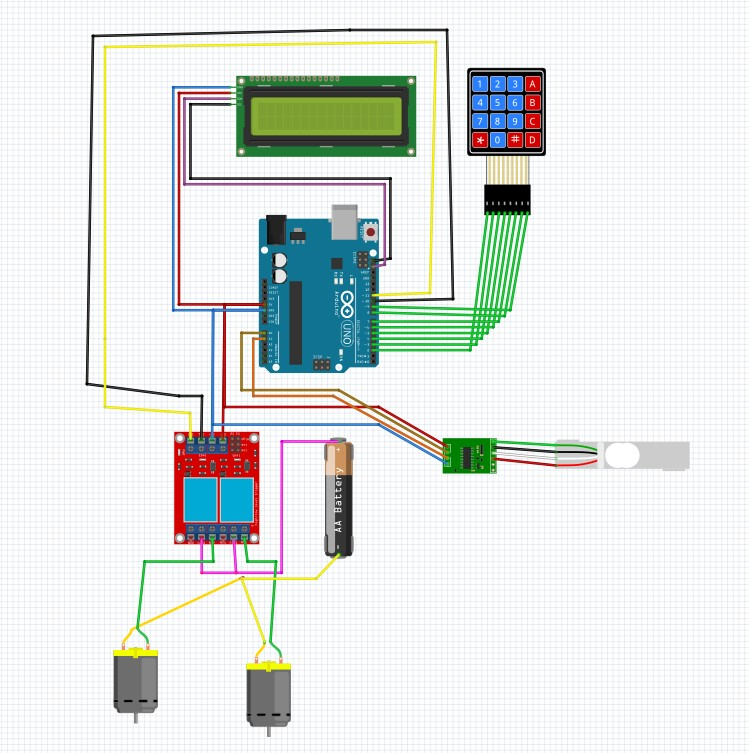

this project with arduino combines to different liquids with different 

shares togther and gets the output in a new tank.

as you could see i used a load cell and an HX711 module in my project so scale unit and the wire map of load cell to HX711 mybe different in your case so test this part and then use the code.

used libararies of this project could be found in libraries dirctory and fritzing file (.fzz) of the project is avaiable in main directory if you want to see the circuit with more details.

so good luck and i hope you enjoy using this project.